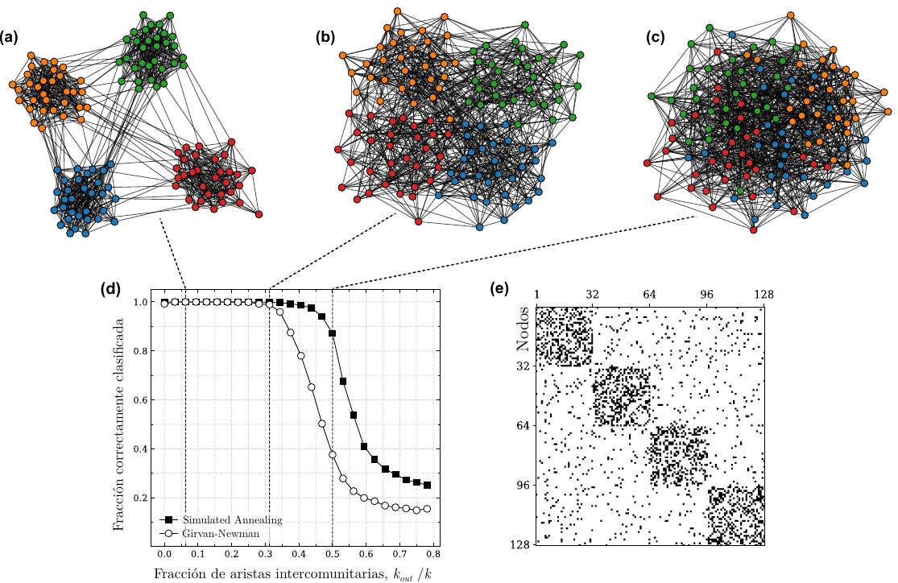
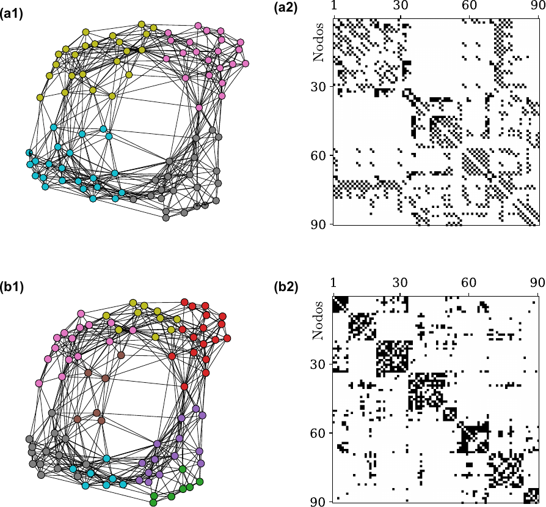
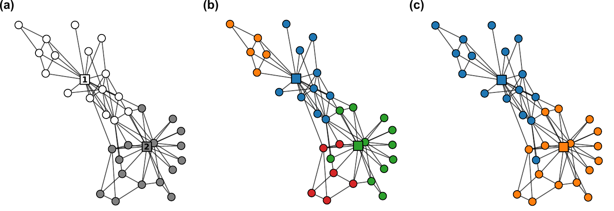

# Complex Network Community Detection

<table align="center">
  <tr>
    <th align="center">SA vs. GN Performance under SBM</th>
    <th align="center">Brain Connectivity</th>
  </tr>
  <tr>
    <td align="center">
      
    </td>
    <td align="center">
      
    </td>
  </tr>
  <tr>
    <th colspan="2" align="center">Zachary Karate Club</th>
  </tr>
  <tr>
    <td colspan="2" align="center">
      
    </td>
  </tr>
</table>

This repository contains a research project focused on community detection in complex networks using **Simulated Annealing (SA)**. The project includes the core implementation of the algorithm, scripts for testing against synthetic networks (Stochastic Block Models), and applications to real-world networks (social networks, power grids, and brain connectivity).

A detailed article (in Spanish) with full explanations of the mathematical framework, algorithm derivations, and experimental results is available in **`project.pdf`** (click [here](project.pdf)). The work was co-authored by Adriana Navarrete Campillo.

## Requirements and Installation

This project requires a standard Python environment with scientific computing libraries.

### Prerequisites

*   Python 3.x
*   `pip` (Python package manager)

### Installation

1.  **Clone the repository:**
    ```bash
    git clone https://github.com/ItsQuark/community-detection-SA.git
    cd community-detection-SA
    ```

2.  **Install core dependencies:**
    ```bash
    pip install numpy pandas scipy matplotlib networkx numba
    ```

3.  **Install ForceAtlas2:**
    The project utilizes the ForceAtlas2 algorithm for network visualization.
    ```bash
    pip install fa2
    ```

---

## Overview of the Project

This project aims to implement and apply a community detection algorithm based on **Simulated Annealing (SA)**. The modularity function $Q$ (see *M. E. J. Newman, Equivalence between modularity optimization and maximum likelihood methods for community detection, 94, 052315*) is optimized dynamically, allowing the algorithm to find the optimal number of communities without pre-fixing it.

The repository is structured as follows:

- **`moduleNX.py`**: Core engine implementing the SA algorithm with Numba-accelerated routines.
- **`3_4_SA_figures.py`**: Generates network visualizations of Synthetic Block Models (SBM) with varying fractions of inter-community edges ($k_{out}/k$).
- **`3_4_SA_guimera.py`**: Performance evaluation of SA against the Girvan–Newman benchmark, measuring normalized mutual information (NMI) as a function of $k_{out}/k$. See FIG. 1 in *R. Guimerà and L. A. Nunes Amaral, Functional cartography of complex metabolic networks, 433, 895*.
- **`3_5_SA_realNets.py`**: Applies the SA algorithm to three real-world networks: Dolphins (social), American college football, and the Western US power grid.
- **`4_brain.py`**: Application to structural brain connectivity matrices (88 healthy subjects from the AAL atlas), analyzing community structure at different resolution levels.
- **`5_gamma_zachary.py`**: Resolution-parameter sweep ($\gamma$) on Zachary's Karate Club network, tracking the number of communities and modularity as $\gamma$ varies.

---

## Core Engine: `moduleNX.py`

**`moduleNX.py`** is the central engine of this project. It houses the high-performance implementation of the community detection algorithm. It leverages `numba` for just-in-time compilation of critical computational loops, ensuring efficiency on large networks.

Key components include:

*   **`simulated_annealing(...)`**: The main function that drives the optimization.
*   **`plot_network(...)`**: Provides standardized plotting routines for visualizing graphs and their partitions, supporting multiple layouts, including ForceAtlas2.
*   **`sbm_gn(...)`**: Generates synthetic networks based on the Stochastic Block Model.
*   **Helper functions (`shift`, `calculate_inner_degrees`, `extract_neighbours`)**: Highly optimized routines (decorated with `@njit`) to handle partition updates and modularity calculations.

### The Simulated Annealing Algorithm Explained

This project uses **Simulated Annealing** to optimize the modularity function $Q$ and detect community structures dynamically.

#### State Representation
The system state is represented by a partition vector $\boldsymbol{c} \in \mathbb{N}^N$, where $c_i \in \{0, 1, \dots, M-1\}$ denotes the community to which node $i$ belongs. The number of communities $M$ is not fixed and varies dynamically during optimization.

To avoid redundant representations, the vector is maintained in **canonical form**:
1.  Community labels are assigned in order of first appearance.
2.  Therefore, $c_0$ is always 0.
3.  Every new label is the smallest unused integer.

An index $m_\emptyset$ points to the first available empty label, allowing the algorithm to propose the creation of a new community at each iteration.

#### Optimized Data Structures
To ensure efficiency during the computationally expensive optimization process, we maintain:
*   **Occurrence Vector ($\boldsymbol{\sigma}$):** $\sigma_m$ tracks the number of nodes currently assigned to community $m$.
*   **Degree Vector ($K_{inn,m}$):** Defined as $K_{inn,m} = \sum_{i \in C_m} k_i$, it accumulates the sum of the degrees of nodes in community $m$. This is crucial for efficient evaluation of the modularity change ($\Delta Q$).

#### Optimization Process
In each iteration:
1.  A node $l$ is selected randomly.
2.  Its current community is $m_i = c_l$.
3.  A transfer to a destination community $m_j \neq m_i$ is proposed, chosen uniformly among existing communities or the empty community $m_\emptyset$.

#### Modularity Change Calculation ($\Delta Q$)
The modularity is defined as:

$$
Q(\boldsymbol{c}; \gamma) = \sum_{m=1}^{M} \left[ \frac{K_{mm}}{K} - \gamma \left( \frac{K_{inn,m}}{2K} \right)^2 \right]
$$

Where $K_{mm}$ is the number of connections between nodes within community $C_m$, and $K_{inn,m}$ is the sum of degrees of all nodes in $C_m$.

The change in modularity ($\Delta Q$) associated with the proposed transfer $c_l = m_i \rightarrow m_j$ is efficiently calculated as:

$$
\Delta Q = \frac{k_{l \to m_j} - k_{l \to m_i}}{K} - \gamma \frac{k_l (k_l + K_{m_j} - K_{m_i})}{2K^2}
$$

(Where $k_l$ is the degree of node $l$ and $k_{l \to m}$ is the number of edges connecting node $l$ to community $m$).
